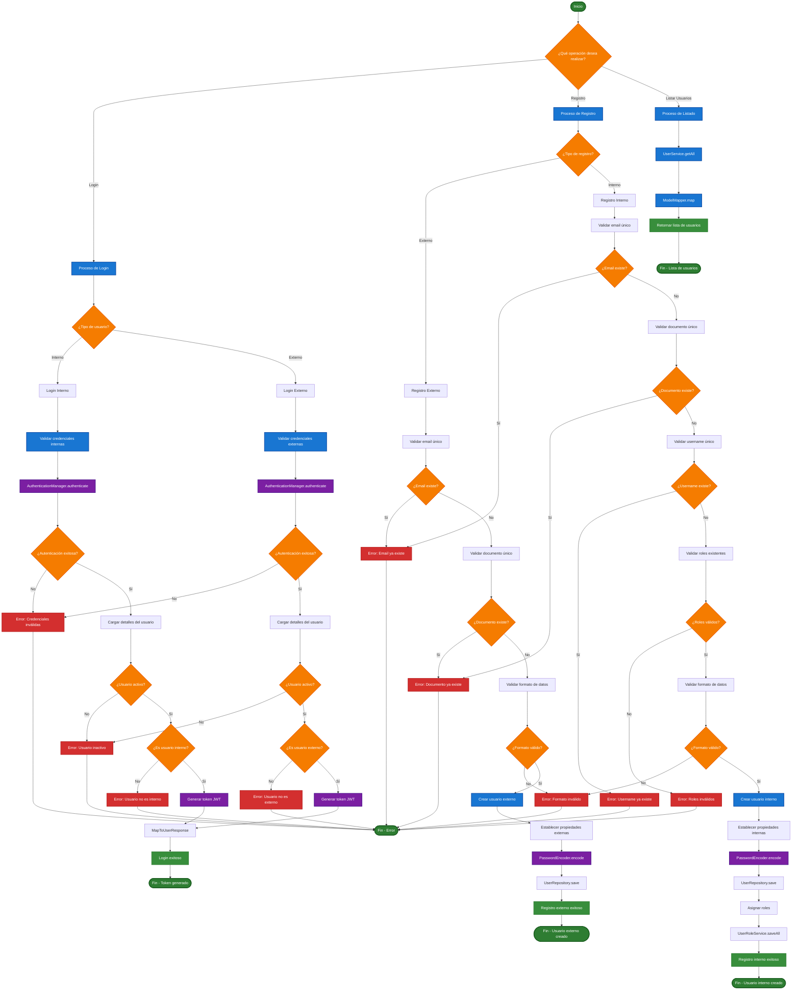
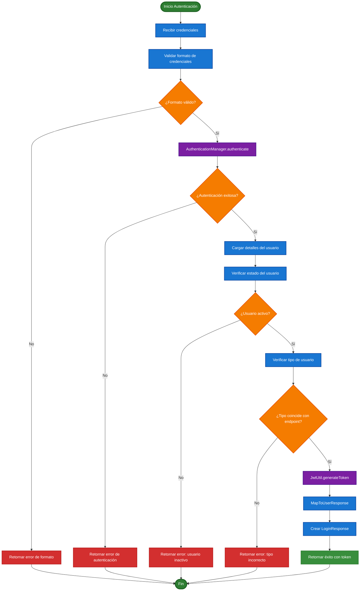
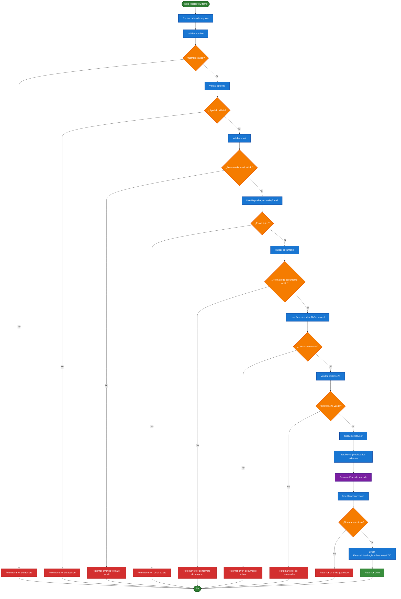
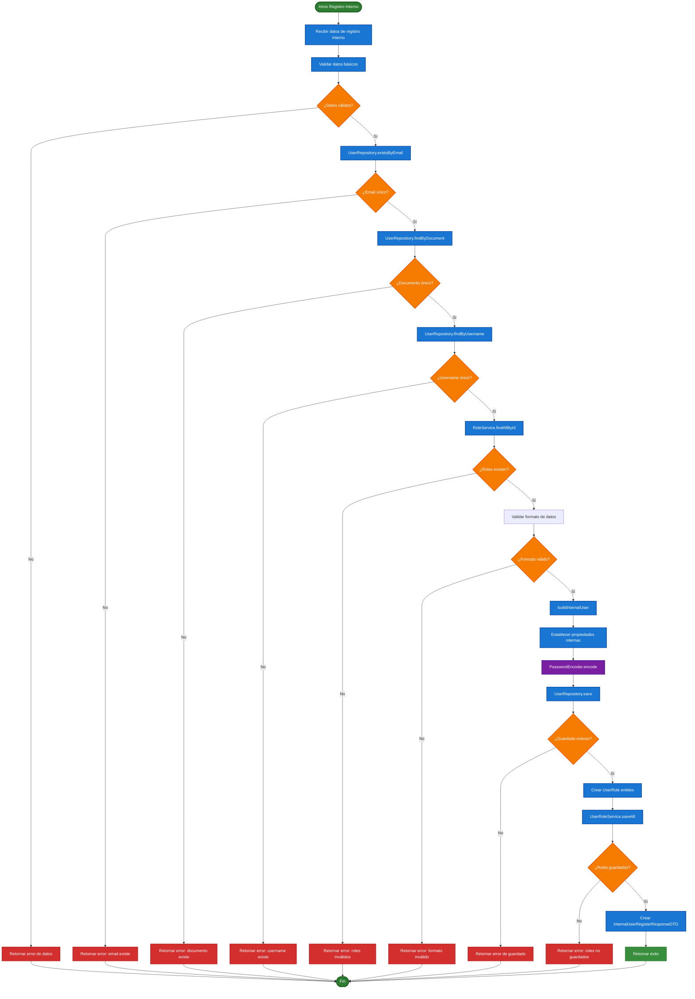
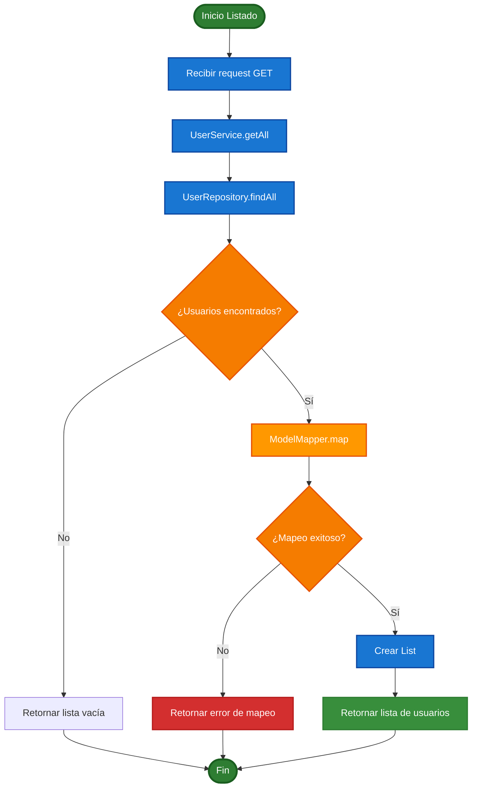
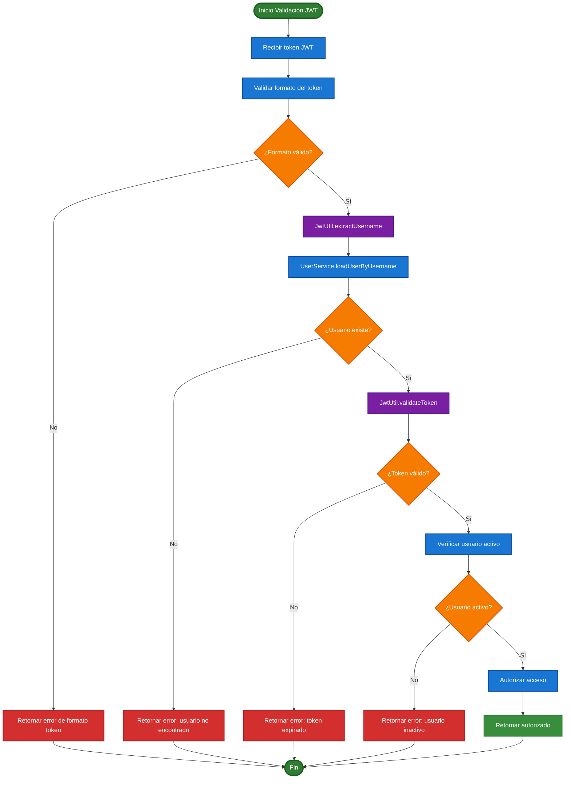

# Diagrama BPMN Actualizado - Sistema de Gestión de Usuarios

## Proceso Principal de Autenticación y Registro

## Proceso Detallado de Autenticación con JWT

## Proceso Detallado de Registro Externo

## Proceso Detallado de Registro Interno

## Proceso de Listado de Usuarios (Debug)

## Proceso de Validación de Seguridad JWT

## Resumen de Procesos BPMN Actualizados

### **1. Proceso Principal de Autenticación y Registro**
- **Entrada**: Credenciales de usuario (username/email, password)
- **Procesos**: Validación, AuthenticationManager, generación JWT, verificación de estado y tipo
- **Salida**: Token JWT o error
- **Nuevo**: Incluye AuthenticationManager y JwtUtil

### **2. Proceso de Autenticación Detallado**
- **Validaciones**: Formato, AuthenticationManager, credenciales, estado del usuario, tipo de usuario
- **Puntos de decisión**: 5 niveles de validación
- **Resultados**: Éxito con token JWT o error específico
- **Nuevo**: Incluye MapToUserResponse y creación de LoginResponse

### **3. Proceso de Registro Externo**
- **Validaciones**: 6 campos obligatorios con validaciones específicas
- **Verificaciones**: Unicidad de email y documento usando Repository
- **Configuración**: Usuario inactivo, externo, username = documento
- **Nuevo**: Incluye PasswordEncoder.encode y UserRepository.save

### **4. Proceso de Registro Interno**
- **Validaciones**: 7 campos obligatorios + roles
- **Verificaciones**: Unicidad de email, documento y username usando Repository
- **Configuración**: Usuario activo, interno, roles asignados
- **Nuevo**: Incluye RoleService.findAllById y UserRoleService.saveAll

### **5. Proceso de Listado de Usuarios (Nuevo)**
- **Validaciones**: Verificación de existencia de usuarios
- **Procesamiento**: ModelMapper para conversión a UserDebugModel
- **Resultado**: Lista de usuarios con información de debug
- **Nuevo**: Endpoint GET para desarrollo y testing

### **6. Proceso de Validación de Seguridad JWT**
- **Validaciones**: Token JWT, expiración, usuario activo
- **Autorización**: Verificación de permisos y estado
- **Nuevo**: Incluye JwtUtil.extractUsername y JwtUtil.validateToken

