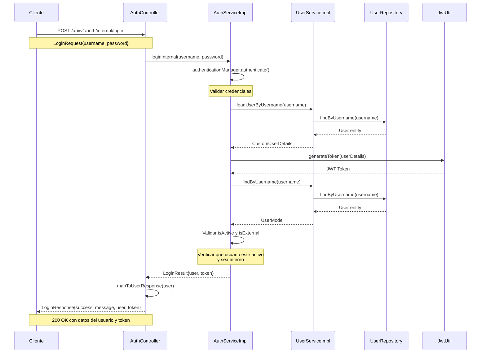
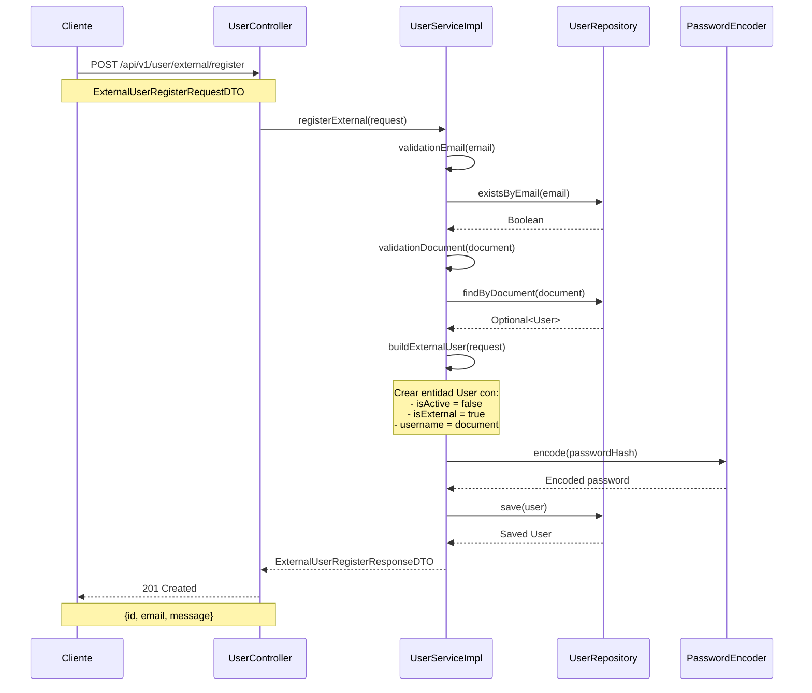
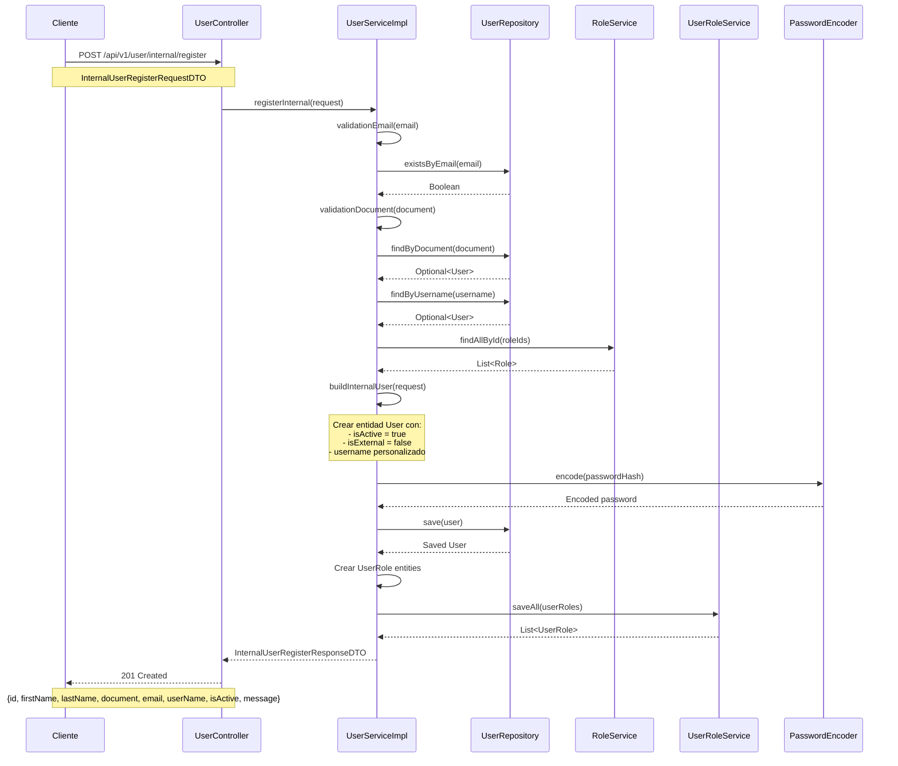

# Diagrama UML - Sistema de Gestión de Usuarios

## Diagrama de Clases UML

```mermaid
classDiagram
    %% Controladores
    class AuthController {
        -AuthServiceImpl authServiceImpl
        +loginInternal(LoginRequest) ResponseEntity~LoginResponse~
        +loginExternal(LoginRequest) ResponseEntity~LoginResponse~
        -mapToUserResponse(UserModel) UserResponse
    }
    
    class UserController {
        -UserService userService
        +registerExternal(ExternalUserRegisterRequestDTO) ResponseEntity~ExternalUserRegisterResponseDTO~
        +registerInternal(InternalUserRegisterRequestDTO) ResponseEntity~InternalUserRegisterResponseDTO~
        +getAll() ResponseEntity~List~UserDebugModel~~
    }
    
    %% Servicios
    class AuthServiceImpl {
        -AuthenticationManager authenticationManager
        -JwtUtil jwtUtil
        -UserServiceImpl usuarioService
        +loginInternal(String, String) LoginResult
        +loginExternal(String, String) LoginResult
        -mapToModel(User) UserModel
    }
    
    class UserServiceImpl {
        -UserRepository userRepository
        -ModelMapper modelMapper
        -RoleService roleService
        -PasswordEncoder passwordEncoder
        -UserRoleService userRoleService
        +findById(Long) UserModel
        +findByUsername(String) UserModel
        +findByEmail(String) UserModel
        +findAll() List~UserModel~
        +loadUserByUsername(String) CustomUserDetails
        +registerExternal(ExternalUserRegisterRequestDTO) ExternalUserRegisterResponseDTO
        +registerInternal(InternalUserRegisterRequestDTO) InternalUserRegisterResponseDTO
        +getAll() List~UserDebugModel~
        -buildExternalUser(ExternalUserRegisterRequestDTO, String, String) User
        -buildInternalUser(InternalUserRegisterRequestDTO, String, String, String) User
        -validationDocument(String) void
        -validationEmail(String) void
        -mapToModel(User) UserModel
    }
    
    %% Entidades
    class User {
        -Long id
        -String firstName
        -String lastName
        -String username
        -String email
        -String document
        -String passwordHash
        -Boolean isActive
        -Boolean isEmailVerified
        -Boolean isExternal
        -LocalDateTime createdAt
        -LocalDateTime updatedAt
        -Set~UserRole~ userRoles
        +getId() Long
        +getFirstName() String
        +getLastName() String
        +getUsername() String
        +getEmail() String
        +getDocument() String
        +getPasswordHash() String
        +getIsActive() Boolean
        +getIsEmailVerified() Boolean
        +getIsExternal() Boolean
        +getCreatedAt() LocalDateTime
        +getUpdatedAt() LocalDateTime
        +getUserRoles() Set~UserRole~
    }
    
    class Role {
        -Long id
        -String name
        -String description
        -Set~UserRole~ userRoles
        +getId() Long
        +getName() String
        +getDescription() String
        +getUserRoles() Set~UserRole~
    }
    
    class UserRole {
        -UserRoleId id
        -User user
        -Role role
        +getId() UserRoleId
        +getUser() User
        +getRole() Role
    }
    
    class UserRoleId {
        -Long userId
        -Long roleId
        +getUserId() Long
        +getRoleId() Long
    }
    
    class EmailVerification {
        -Long id
        -User user
        -String token
        -LocalDateTime expiresAt
        -Boolean isUsed
        +getId() Long
        +getUser() User
        +getToken() String
        +getExpiresAt() LocalDateTime
        +getIsUsed() Boolean
    }
    
    class RecoveryToken {
        -Long id
        -User user
        -String token
        -LocalDateTime expiresAt
        -Boolean isUsed
        +getId() Long
        +getUser() User
        +getToken() String
        +getExpiresAt() LocalDateTime
        +getIsUsed() Boolean
    }
    
    %% DTOs
    class LoginRequest {
        -String username
        -String email
        -String password
        +getUsername() String
        +getEmail() String
        +getPassword() String
    }
    
    class LoginResponse {
        -Boolean success
        -String message
        -UserResponse user
        -String token
        +getSuccess() Boolean
        +getMessage() String
        +getUser() UserResponse
        +getToken() String
    }
    
    class UserResponse {
        -Long id
        -String firstName
        -String lastName
        -String username
        -String email
        -String document
        -Boolean isActive
        -Boolean isEmailVerified
        -Boolean isExternal
        -LocalDateTime createdAt
        -LocalDateTime updatedAt
        +getId() Long
        +getFirstName() String
        +getLastName() String
        +getUsername() String
        +getEmail() String
        +getDocument() String
        +getIsActive() Boolean
        +getIsEmailVerified() Boolean
        +getIsExternal() Boolean
        +getCreatedAt() LocalDateTime
        +getUpdatedAt() LocalDateTime
    }
    
    class ExternalUserRegisterRequestDTO {
        -String firstName
        -String lastName
        -String email
        -String document
        -String passwordHash
        +getFirstName() String
        +getLastName() String
        +getEmail() String
        +getDocument() String
        +getPasswordHash() String
    }
    
    class ExternalUserRegisterResponseDTO {
        -Long id
        -String email
        -String message
        +getId() Long
        +getEmail() String
        +getMessage() String
    }
    
    class InternalUserRegisterRequestDTO {
        -String firstName
        -String lastName
        -String document
        -String email
        -String username
        -String passwordHash
        -List~Long~ role
        +getFirstName() String
        +getLastName() String
        +getDocument() String
        +getEmail() String
        +getUsername() String
        +getPasswordHash() String
        +getRole() List~Long~
    }
    
    class InternalUserRegisterResponseDTO {
        -Long id
        -String firstName
        -String lastName
        -String document
        -String email
        -String userName
        -Boolean isActive
        -String message
        +getId() Long
        +getFirstName() String
        +getLastName() String
        +getDocument() String
        +getEmail() String
        +getUserName() String
        +getIsActive() Boolean
        +getMessage() String
    }
    
    class UserDebugModel {
        -Long id
        -String firstName
        -String lastName
        -String username
        -String email
        -String document
        -String passwordHash
        -Boolean isActive
        -Boolean isExternal
        -LocalDateTime createdAt
        -List~String~ roles
        +getId() Long
        +getFirstName() String
        +getLastName() String
        +getUsername() String
        +getEmail() String
        +getDocument() String
        +getPasswordHash() String
        +getIsActive() Boolean
        +getIsExternal() Boolean
        +getCreatedAt() LocalDateTime
        +getRoles() List~String~
        +fromEntity(User) UserDebugModel
    }
    
    %% Modelos
    class UserModel {
        -Long id
        -String firstName
        -String lastName
        -String username
        -String email
        -String document
        -Boolean isActive
        -Boolean isEmailVerified
        -Boolean isExternal
        -LocalDateTime createdAt
        -LocalDateTime updatedAt
        +getId() Long
        +getFirstName() String
        +getLastName() String
        +getUsername() String
        +getEmail() String
        +getDocument() String
        +getIsActive() Boolean
        +getIsEmailVerified() Boolean
        +getIsExternal() Boolean
        +getCreatedAt() LocalDateTime
        +getUpdatedAt() LocalDateTime
    }
    
    class LoginResult {
        -UserModel user
        -String token
        +getUser() UserModel
        +getToken() String
    }
    
    %% Seguridad
    class CustomUserDetails {
        -Long id
        -String username
        -String password
        -Collection~GrantedAuthority~ authorities
        +getId() Long
        +getUsername() String
        +getPassword() String
        +getAuthorities() Collection~GrantedAuthority~
    }
    
    class JwtUtil {
        -String secret
        -int expiration
        +generateToken(CustomUserDetails) String
        +extractUsername(String) String
        +validateToken(String, CustomUserDetails) Boolean
    }
    
    class JwtRequestFilter {
        -JwtUtil jwtUtil
        -UserServiceImpl userService
        +doFilterInternal(ServletRequest, ServletResponse, FilterChain) void
    }
    
    %% Repositorios
    class UserRepository {
        +findById(Long) Optional~User~
        +findByUsername(String) Optional~User~
        +findByEmail(String) Optional~User~
        +findByDocument(String) Optional~User~
        +existsByEmail(String) Boolean
        +save(User) User
        +findAll() List~User~
    }
    
    class RoleRepository {
        +findById(Long) Optional~Role~
        +findAllById(List~Long~) List~Role~
        +save(Role) Role
        +findAll() List~Role~
    }
    
    class UserRoleRepository {
        +save(UserRole) UserRole
        +saveAll(List~UserRole~) List~UserRole~
        +findByUser(User) List~UserRole~
        +findByRole(Role) List~UserRole~
    }
    
    %% Servicios de Negocio
    class RoleService {
        +findById(Long) Role
        +findAllById(List~Long~) List~Role~
        +save(Role) Role
        +findAll() List~Role~
    }
    
    class UserRoleService {
        +save(UserRole) UserRole
        +saveAll(List~UserRole~) List~UserRole~
        +findByUser(User) List~UserRole~
        +findByRole(Role) List~UserRole~
    }
    
    %% Relaciones
    AuthController --> AuthServiceImpl : uses
    UserController --> UserServiceImpl : uses
    AuthServiceImpl --> UserServiceImpl : uses
    AuthServiceImpl --> JwtUtil : uses
    UserServiceImpl --> UserRepository : uses
    UserServiceImpl --> RoleService : uses
    UserServiceImpl --> UserRoleService : uses
    UserServiceImpl --> PasswordEncoder : uses
    
    User ||--o{ UserRole : has
    Role ||--o{ UserRole : assigned to
    UserRole }o--|| UserRoleId : identified by
    User ||--o{ EmailVerification : has
    User ||--o{ RecoveryToken : has
    
    UserRepository --> User : manages
    RoleRepository --> Role : manages
    UserRoleRepository --> UserRole : manages
    
    RoleService --> RoleRepository : uses
    UserRoleService --> UserRoleRepository : uses
    
    %% Conversiones
    UserModel <-- User : maps to
    UserResponse <-- UserModel : maps to
    UserDebugModel <-- User : maps to
    LoginResult --> UserModel : contains
    LoginResponse --> UserResponse : contains
    LoginResponse --> LoginResult : maps from
```

## Diagrama de Secuencia - Proceso de Login



## Diagrama de Secuencia - Proceso de Registro Externo



## Diagrama de Secuencia - Proceso de Registro Interno



## Resumen de la Arquitectura

### Capas de la Aplicación:

1. **Capa de Presentación (Controllers)**:
   - `AuthController`: Maneja autenticación (login interno/externo)
   - `UserController`: Maneja registro de usuarios

2. **Capa de Servicios**:
   - `AuthServiceImpl`: Lógica de autenticación y generación de tokens JWT
   - `UserServiceImpl`: Lógica de negocio para gestión de usuarios

3. **Capa de Datos**:
   - `UserRepository`: Acceso a datos de usuarios
   - `RoleRepository`: Acceso a datos de roles
   - `UserRoleRepository`: Acceso a datos de relaciones usuario-rol

4. **Capa de Seguridad**:
   - `JwtUtil`: Utilidades para manejo de tokens JWT
   - `CustomUserDetails`: Detalles del usuario para Spring Security
   - `JwtRequestFilter`: Filtro para validación de tokens JWT

### Patrones de Diseño Utilizados:

- **Repository Pattern**: Para acceso a datos
- **Service Layer Pattern**: Para lógica de negocio
- **DTO Pattern**: Para transferencia de datos
- **Builder Pattern**: Para construcción de entidades
- **Strategy Pattern**: Para diferentes tipos de autenticación (interno/externo)

### Flujo de Datos:

1. **Autenticación**: Cliente → Controller → Service → Repository → Database
2. **Registro**: Cliente → Controller → Service → Repository → Database
3. **Validación**: Service → Repository → Database (verificación de unicidad)
4. **Seguridad**: JWT Token → Filter → Service → Database

