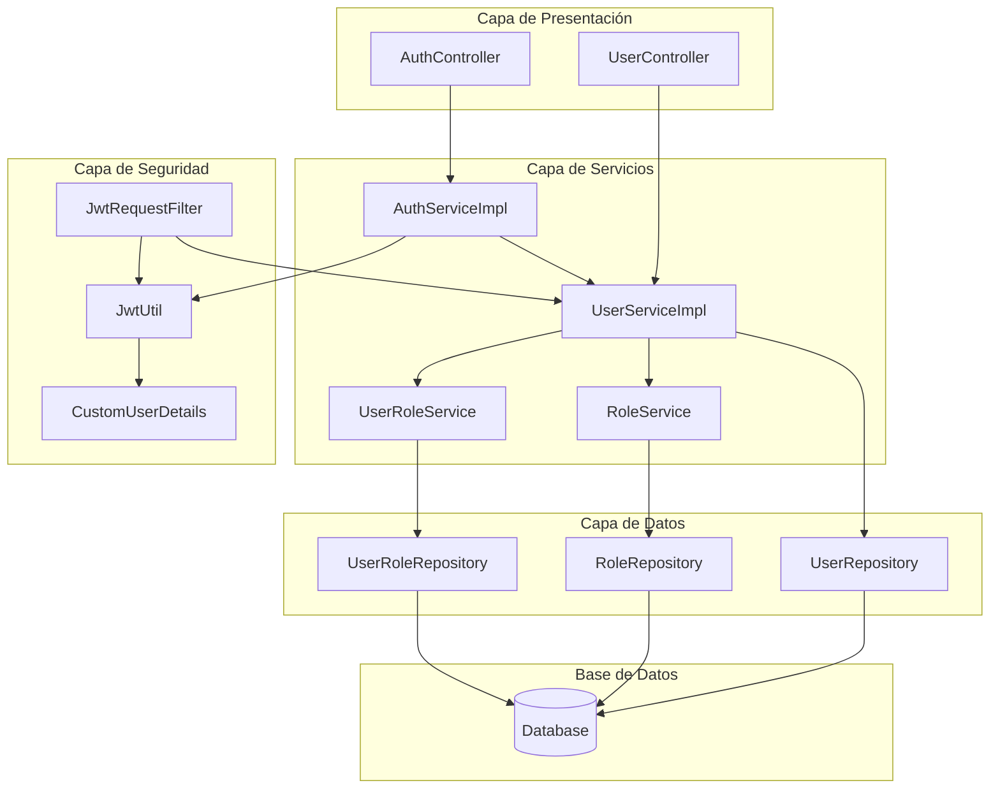

# Diagrama UML Simplificado - Sistema de Gestión de Usuarios

## Diagrama de Clases Principal

```mermaid
classDiagram
    %% Controladores
    class AuthController {
        -AuthServiceImpl authService
        +loginInternal(LoginRequest) LoginResponse
        +loginExternal(LoginRequest) LoginResponse
    }
    
    class UserController {
        -UserService userService
        +registerExternal(ExternalUserRegisterRequestDTO) ExternalUserRegisterResponseDTO
        +registerInternal(InternalUserRegisterRequestDTO) InternalUserRegisterResponseDTO
        +getAll() List~UserDebugModel~
    }
    
    %% Servicios
    class AuthServiceImpl {
        -AuthenticationManager authManager
        -JwtUtil jwtUtil
        -UserService userService
        +loginInternal(String, String) LoginResult
        +loginExternal(String, String) LoginResult
    }
    
    class UserServiceImpl {
        -UserRepository userRepository
        -RoleService roleService
        -PasswordEncoder passwordEncoder
        +registerExternal(ExternalUserRegisterRequestDTO) ExternalUserRegisterResponseDTO
        +registerInternal(InternalUserRegisterRequestDTO) InternalUserRegisterResponseDTO
        +findByUsername(String) UserModel
        +loadUserByUsername(String) CustomUserDetails
    }
    
    %% Entidades
    class User {
        -Long id
        -String firstName
        -String lastName
        -String username
        -String email
        -String document
        -String passwordHash
        -Boolean isActive
        -Boolean isEmailVerified
        -Boolean isExternal
        -LocalDateTime createdAt
        -LocalDateTime updatedAt
    }
    
    class Role {
        -Long id
        -String name
        -String description
    }
    
    class UserRole {
        -UserRoleId id
        -User user
        -Role role
    }
    
    %% DTOs de Request
    class LoginRequest {
        -String username
        -String email
        -String password
    }
    
    class ExternalUserRegisterRequestDTO {
        -String firstName
        -String lastName
        -String email
        -String document
        -String passwordHash
    }
    
    class InternalUserRegisterRequestDTO {
        -String firstName
        -String lastName
        -String document
        -String email
        -String username
        -String passwordHash
        -List~Long~ role
    }
    
    %% DTOs de Response
    class LoginResponse {
        -Boolean success
        -String message
        -UserResponse user
        -String token
    }
    
    class UserResponse {
        -Long id
        -String firstName
        -String lastName
        -String username
        -String email
        -String document
        -Boolean isActive
        -Boolean isEmailVerified
        -Boolean isExternal
        -LocalDateTime createdAt
        -LocalDateTime updatedAt
    }
    
    class ExternalUserRegisterResponseDTO {
        -Long id
        -String email
        -String message
    }
    
    class InternalUserRegisterResponseDTO {
        -Long id
        -String firstName
        -String lastName
        -String document
        -String email
        -String userName
        -Boolean isActive
        -String message
    }
    
    %% Modelos
    class UserModel {
        -Long id
        -String firstName
        -String lastName
        -String username
        -String email
        -String document
        -Boolean isActive
        -Boolean isEmailVerified
        -Boolean isExternal
        -LocalDateTime createdAt
        -LocalDateTime updatedAt
    }
    
    class LoginResult {
        -UserModel user
        -String token
    }
    
    %% Seguridad
    class CustomUserDetails {
        -Long id
        -String username
        -String password
        -Collection authorities
    }
    
    class JwtUtil {
        -String secret
        -int expiration
        +generateToken(CustomUserDetails) String
        +extractUsername(String) String
        +validateToken(String, CustomUserDetails) Boolean
    }
    
    %% Repositorios
    class UserRepository {
        +findById(Long) Optional~User~
        +findByUsername(String) Optional~User~
        +findByEmail(String) Optional~User~
        +findByDocument(String) Optional~User~
        +existsByEmail(String) Boolean
        +save(User) User
        +findAll() List~User~
    }
    
    class RoleRepository {
        +findById(Long) Optional~Role~
        +findAllById(List~Long~) List~Role~
        +save(Role) Role
        +findAll() List~Role~
    }
    
    class UserRoleRepository {
        +save(UserRole) UserRole
        +saveAll(List~UserRole~) List~UserRole~
        +findByUser(User) List~UserRole~
        +findByRole(Role) List~UserRole~
    }
    
    %% Servicios de Negocio
    class RoleService {
        +findById(Long) Role
        +findAllById(List~Long~) List~Role~
        +save(Role) Role
        +findAll() List~Role~
    }
    
    class UserRoleService {
        +save(UserRole) UserRole
        +saveAll(List~UserRole~) List~UserRole~
        +findByUser(User) List~UserRole~
        +findByRole(Role) List~UserRole~
    }
    
    %% Relaciones principales
    AuthController --> AuthServiceImpl
    UserController --> UserServiceImpl
    AuthServiceImpl --> UserServiceImpl
    AuthServiceImpl --> JwtUtil
    UserServiceImpl --> UserRepository
    UserServiceImpl --> RoleService
    UserServiceImpl --> UserRoleService
    
    User ||--o{ UserRole
    Role ||--o{ UserRole
    User ||--o{ EmailVerification
    User ||--o{ RecoveryToken
    
    UserRepository --> User
    RoleRepository --> Role
    UserRoleRepository --> UserRole
    
    RoleService --> RoleRepository
    UserRoleService --> UserRoleRepository
    
    %% Conversiones
    UserModel <-- User
    UserResponse <-- UserModel
    LoginResult --> UserModel
    LoginResponse --> UserResponse
```

## Diagrama de Secuencia - Login Interno


## Diagrama de Secuencia - Registro Externo


## Diagrama de Secuencia - Registro Interno


## Arquitectura del Sistema



## Resumen de la Arquitectura

### **Capas del Sistema:**

1. **Capa de Presentación (Controllers)**:
   - `AuthController`: Maneja autenticación
   - `UserController`: Maneja registro de usuarios

2. **Capa de Servicios**:
   - `AuthServiceImpl`: Lógica de autenticación
   - `UserServiceImpl`: Lógica de gestión de usuarios
   - `RoleService`: Gestión de roles
   - `UserRoleService`: Gestión de relaciones usuario-rol

3. **Capa de Datos**:
   - `UserRepository`: Acceso a datos de usuarios
   - `RoleRepository`: Acceso a datos de roles
   - `UserRoleRepository`: Acceso a relaciones

4. **Capa de Seguridad**:
   - `JwtUtil`: Manejo de tokens JWT
   - `CustomUserDetails`: Detalles del usuario
   - `JwtRequestFilter`: Filtro de autenticación

### **Flujos Principales:**

1. **Autenticación**: Cliente → Controller → Service → Repository → Database
2. **Registro**: Cliente → Controller → Service → Repository → Database
3. **Validación**: Service → Repository → Database
4. **Seguridad**: JWT Token → Filter → Service → Database

### **Patrones Utilizados:**

- **Repository Pattern**: Para acceso a datos
- **Service Layer Pattern**: Para lógica de negocio
- **DTO Pattern**: Para transferencia de datos
- **Builder Pattern**: Para construcción de entidades
- **Strategy Pattern**: Para diferentes tipos de autenticación

