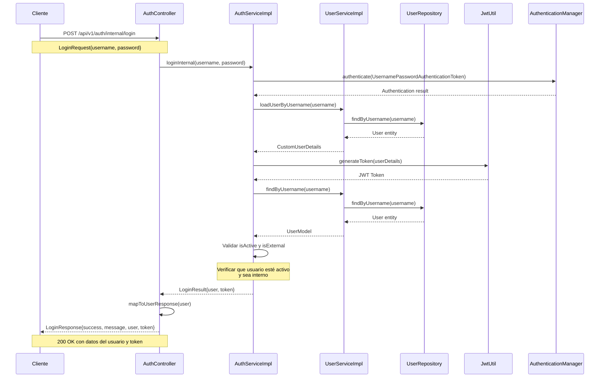
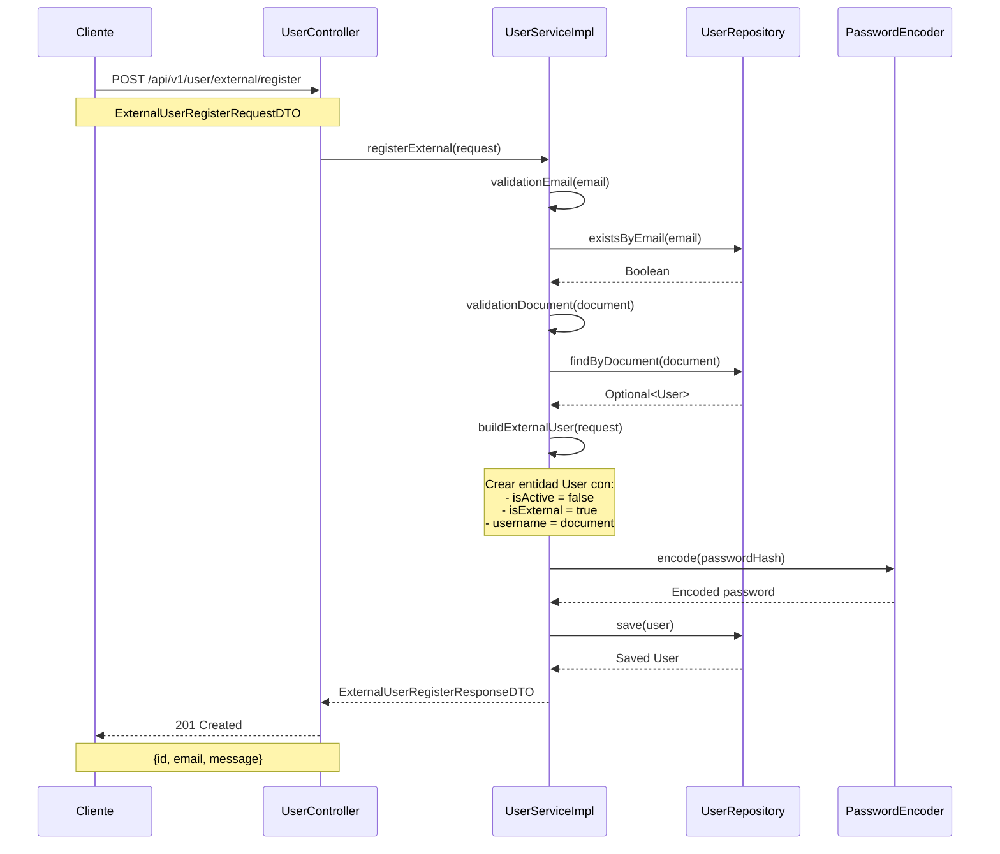
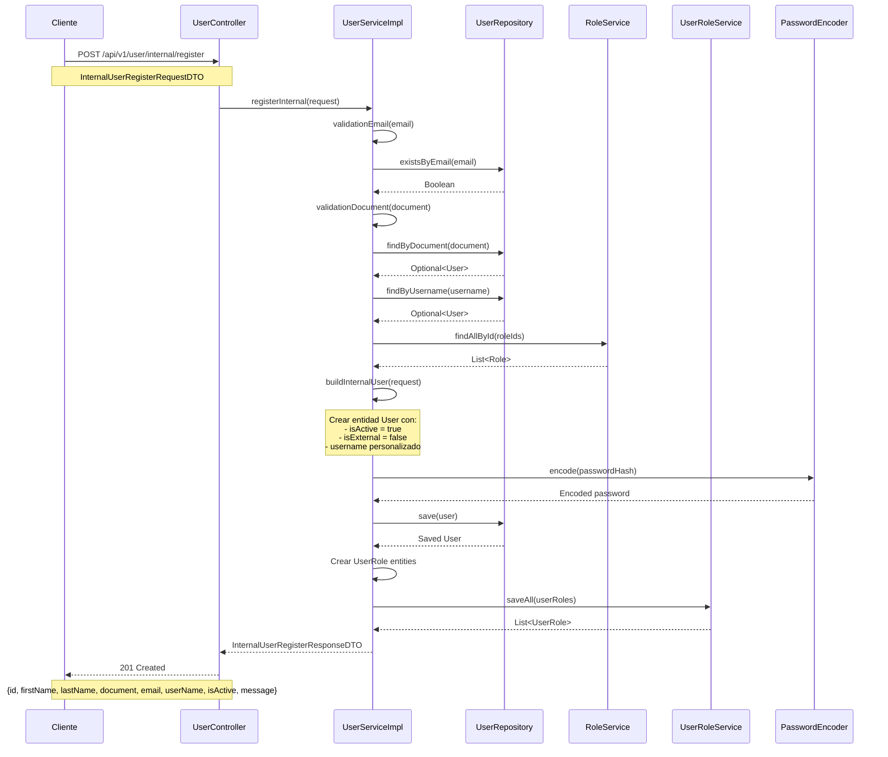
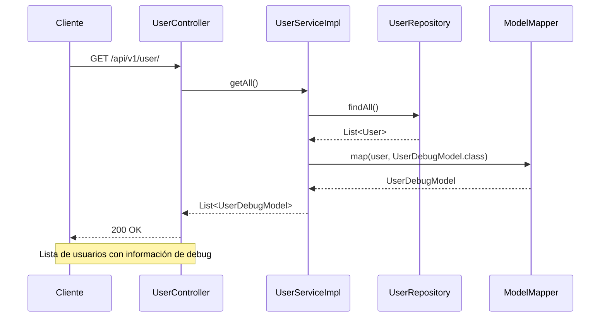
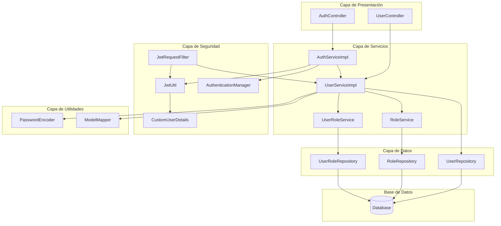

# Diagrama UML Actualizado - Sistema de Gestión de Usuarios

## Diagrama de Clases Principal

```mermaid
classDiagram
    %% Controladores
    class AuthController {
        -AuthServiceImpl authServiceImpl
        +loginInternal(LoginRequest) ResponseEntity~LoginResponse~
        +loginExternal(LoginRequest) ResponseEntity~LoginResponse~
        -mapToUserResponse(UserModel) UserResponse
    }
    
    class UserController {
        -UserService userService
        +registerExternal(ExternalUserRegisterRequestDTO) ResponseEntity~ExternalUserRegisterResponseDTO~
        +registerInternal(InternalUserRegisterRequestDTO) ResponseEntity~InternalUserRegisterResponseDTO~
        +getAll() ResponseEntity~List~UserDebugModel~~
    }
    
    %% Servicios
    class AuthServiceImpl {
        -AuthenticationManager authenticationManager
        -JwtUtil jwtUtil
        -UserServiceImpl usuarioService
        +loginInternal(String, String) LoginResult
        +loginExternal(String, String) LoginResult
        -mapToModel(User) UserModel
    }
    
    class UserServiceImpl {
        -UserRepository userRepository
        -ModelMapper modelMapper
        -RoleService roleService
        -PasswordEncoder passwordEncoder
        -UserRoleService userRoleService
        +findById(Long) UserModel
        +findByUsername(String) UserModel
        +findByEmail(String) UserModel
        +findAll() List~UserModel~
        +loadUserByUsername(String) CustomUserDetails
        +registerExternal(ExternalUserRegisterRequestDTO) ExternalUserRegisterResponseDTO
        +registerInternal(InternalUserRegisterRequestDTO) InternalUserRegisterResponseDTO
        +getAll() List~UserDebugModel~
        -buildExternalUser(ExternalUserRegisterRequestDTO, String, String) User
        -buildInternalUser(InternalUserRegisterRequestDTO, String, String, String) User
        -validationDocument(String) void
        -validationEmail(String) void
        -mapToModel(User) UserModel
    }
    
    %% Entidades
    class User {
        -Long id
        -String firstName
        -String lastName
        -String username
        -String email
        -String document
        -String passwordHash
        -Boolean isActive
        -Boolean isEmailVerified
        -Boolean isExternal
        -LocalDateTime createdAt
        -LocalDateTime updatedAt
        -Set~UserRole~ userRoles
    }
    
    class Role {
        -Long id
        -String name
        -String description
        -Set~UserRole~ userRoles
    }
    
    class UserRole {
        -UserRoleId id
        -User user
        -Role role
    }
    
    class UserRoleId {
        -Long userId
        -Long roleId
    }
    
    class EmailVerification {
        -Long id
        -User user
        -String token
        -LocalDateTime expiresAt
        -Boolean isUsed
    }
    
    class RecoveryToken {
        -Long id
        -User user
        -String token
        -LocalDateTime expiresAt
        -Boolean isUsed
    }
    
    %% DTOs de Request
    class LoginRequest {
        -String username
        -String email
        -String password
    }
    
    class ExternalUserRegisterRequestDTO {
        -String firstName
        -String lastName
        -String email
        -String document
        -String passwordHash
    }
    
    class InternalUserRegisterRequestDTO {
        -String firstName
        -String lastName
        -String document
        -String email
        -String username
        -String passwordHash
        -List~Long~ role
    }
    
    %% DTOs de Response
    class LoginResponse {
        -Boolean success
        -String message
        -UserResponse user
        -String token
    }
    
    class UserResponse {
        -Long id
        -String firstName
        -String lastName
        -String username
        -String email
        -String document
        -Boolean isActive
        -Boolean isEmailVerified
        -Boolean isExternal
        -LocalDateTime createdAt
        -LocalDateTime updatedAt
    }
    
    class ExternalUserRegisterResponseDTO {
        -Long id
        -String email
        -String message
    }
    
    class InternalUserRegisterResponseDTO {
        -Long id
        -String firstName
        -String lastName
        -String document
        -String email
        -String userName
        -Boolean isActive
        -String message
    }
    
    class UserDebugModel {
        -Long id
        -String firstName
        -String lastName
        -String username
        -String email
        -String document
        -String passwordHash
        -Boolean isActive
        -Boolean isExternal
        -LocalDateTime createdAt
        -List~String~ roles
        +fromEntity(User) UserDebugModel
    }
    
    %% Modelos
    class UserModel {
        -Long id
        -String firstName
        -String lastName
        -String username
        -String email
        -String document
        -Boolean isActive
        -Boolean isEmailVerified
        -Boolean isExternal
        -LocalDateTime createdAt
        -LocalDateTime updatedAt
    }
    
    class LoginResult {
        -UserModel user
        -String token
    }
    
    %% Seguridad
    class CustomUserDetails {
        -Long id
        -String username
        -String password
        -Collection authorities
    }
    
    class JwtUtil {
        -String secret
        -int expiration
        +generateToken(CustomUserDetails) String
        +extractUsername(String) String
        +validateToken(String, CustomUserDetails) Boolean
    }
    
    class JwtRequestFilter {
        -JwtUtil jwtUtil
        -UserServiceImpl userService
        +doFilterInternal(ServletRequest, ServletResponse, FilterChain) void
    }
    
    %% Repositorios
    class UserRepository {
        +findById(Long) Optional~User~
        +findByUsername(String) Optional~User~
        +findByEmail(String) Optional~User~
        +findByDocument(String) Optional~User~
        +existsByEmail(String) Boolean
        +save(User) User
        +findAll() List~User~
    }
    
    class RoleRepository {
        +findById(Long) Optional~Role~
        +findAllById(List~Long~) List~Role~
        +save(Role) Role
        +findAll() List~Role~
    }
    
    class UserRoleRepository {
        +save(UserRole) UserRole
        +saveAll(List~UserRole~) List~UserRole~
        +findByUser(User) List~UserRole~
        +findByRole(Role) List~UserRole~
    }
    
    %% Servicios de Negocio
    class RoleService {
        +findById(Long) Role
        +findAllById(List~Long~) List~Role~
        +save(Role) Role
        +findAll() List~Role~
    }
    
    class UserRoleService {
        +save(UserRole) UserRole
        +saveAll(List~UserRole~) List~UserRole~
        +findByUser(User) List~UserRole~
        +findByRole(Role) List~UserRole~
    }
    
    %% Interfaces
    class UserService {
        +registerExternal(ExternalUserRegisterRequestDTO) ExternalUserRegisterResponseDTO
        +registerInternal(InternalUserRegisterRequestDTO) InternalUserRegisterResponseDTO
        +getAll() List~UserDebugModel~
    }
    
    %% Relaciones principales
    AuthController --> AuthServiceImpl
    UserController --> UserService
    UserService <|-- UserServiceImpl
    AuthServiceImpl --> UserServiceImpl
    AuthServiceImpl --> JwtUtil
    UserServiceImpl --> UserRepository
    UserServiceImpl --> RoleService
    UserServiceImpl --> UserRoleService
    
    User --> UserRole
    Role --> UserRole
    User --> EmailVerification
    User --> RecoveryToken
    
    UserRepository --> User
    RoleRepository --> Role
    UserRoleRepository --> UserRole
    
    RoleService --> RoleRepository
    UserRoleService --> UserRoleRepository
    
    JwtRequestFilter --> JwtUtil
    JwtRequestFilter --> UserServiceImpl
    
    %% Conversiones
    UserModel <-- User
    UserResponse <-- UserModel
    LoginResult --> UserModel
    LoginResponse --> UserResponse
    UserDebugModel <-- User
```

## Diagrama de Secuencia - Proceso de Login Interno

## Diagrama de Secuencia - Proceso de Registro Externo

## Diagrama de Secuencia - Proceso de Registro Interno

## Diagrama de Secuencia - Proceso de Obtener Todos los Usuarios

## Arquitectura del Sistema

## Resumen de la Arquitectura Actualizada

### **Capas del Sistema:**

1. **Capa de Presentación (Controllers)**:
   - `AuthController`: Maneja autenticación (login interno/externo)
   - `UserController`: Maneja registro de usuarios y listado

2. **Capa de Servicios**:
   - `AuthServiceImpl`: Lógica de autenticación y generación de tokens JWT
   - `UserServiceImpl`: Lógica de negocio para gestión de usuarios
   - `RoleService`: Gestión de roles
   - `UserRoleService`: Gestión de relaciones usuario-rol

3. **Capa de Datos**:
   - `UserRepository`: Acceso a datos de usuarios
   - `RoleRepository`: Acceso a datos de roles
   - `UserRoleRepository`: Acceso a relaciones

4. **Capa de Seguridad**:
   - `JwtUtil`: Manejo de tokens JWT
   - `CustomUserDetails`: Detalles del usuario para Spring Security
   - `JwtRequestFilter`: Filtro para validación de tokens JWT
   - `AuthenticationManager`: Gestión de autenticación

5. **Capa de Utilidades**:
   - `PasswordEncoder`: Encriptación de contraseñas
   - `ModelMapper`: Mapeo entre entidades y DTOs

### **Flujos Principales:**

1. **Autenticación**: Cliente → Controller → Service → AuthenticationManager → Repository → Database
2. **Registro**: Cliente → Controller → Service → Repository → Database
3. **Validación**: Service → Repository → Database
4. **Seguridad**: JWT Token → Filter → Service → Database

